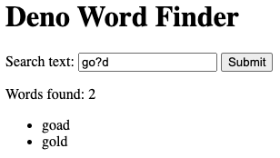

# 用 Deno 构建单词查找应用

## 入门

在本教程中，我们将使用 Deno 创建一个简单的单词查找 Web 应用程序。 不需要 Deno
的先前知识。

## 介绍

我们的单词查找应用程序将接受用户提供的模式字符串，并返回与该模式匹配的英语词典中的所有单词。模式可以包括字母字符以及
`_` 和 `?`。`?` 可以表示不在模式中的任何字母。`_` 可以表示任何字母。

例如，模式 `c?t` 匹配 "cat" 和 "cut"。模式 `go?d` 匹配单词 "goad" 和
"gold"（但不匹配 "good"）。



## 构建视图

以下函数呈现创建上述简单 UI 的 HTML。您可以指定模式和单词列表以自定义 HTML
内容。如果指定了模式，则它将显示在搜索文本框中。如果指定了单词列表，则将呈现带有项目符号的单词列表。

```jsx
// render.js

export function renderHtml(pattern, words) {
  let searchResultsContent = "";
  if (words.length > 0) {
    let wordList = "";
    for (const word of words) {
      wordList += `<li>${word}</li>`;
    }
    searchResultsContent = `
        <p id="search-result-count" data-count="${words.length}">Words found: ${words.length}</p>
        <ul id="search-result" name="search-results"> 
          ${wordList}
        </ul>
      `;
  }

  return `<html>
    <head>
        <title>Deno Word Finder</title>
        <meta name="version" content="1.0" />
    </head>
    <body>
        <h1>Deno Word Finder</h1>
  
        <form id="perform-search" name="perform-search" method="get" action="/api/search">
            <label for="search-text">Search text:</label>
            <input id="search-text" name="search-text" type="text" value="${pattern}" />
            <input type="submit" />
        </form>
  
        ${searchResultsContent}
  
        <h2>Instructions</h2>
  
        <p>
            Enter a word using _ and ? as needed for unknown characters. Using ? means to include letters that aren't already used (you can think of it as a "Wheel of Fortune" placeholder). Using _ will find words that contain any character (whether it's currently "revealed" or not).
            <br />
            <br />
            For example, d__d would return:
            <ul>
                <li>dand</li>
                <li>daud</li>
                <li>dead</li>
                <li>deed</li>
                <li>dird</li>
                <li>dodd</li>
                <li>dowd</li>
                <li>duad</li>
                <li>dyad</li>
            </ul>
            <br />
            And go?d would return:
            <ul>
                <li>goad</li>
                <li>gold</li>
            </ul>
        </p>
    </body>
  </html>
  `;
}
```

## 查找字典

我们还需要一个简单的搜索函数，它扫描字典并返回与指定模式匹配的所有单词。下面的函数接受模式和字典，然后返回所有匹配的单词。

```jsx
// search.js

export function search(pattern, dictionary) {
  // 创建排除单词已经包含字符的正则表达式模式
  let excludeRegex = "";
  for (let i = 0; i < pattern.length; i++) {
    const c = pattern[i];
    if (c != "?" && c != "_") {
      excludeRegex += "^" + c;
    }
  }
  excludeRegex = "[" + excludeRegex + "]";

  // 让问号仅匹配单词中不包含的字符
  let searchPattern = pattern.replace(/\?/g, excludeRegex);

  // 让下划线匹配任何字符
  searchPattern = "^" + searchPattern.replace(/\_/g, "[a-z]") + "$";

  // 查找所有与模式匹配的字典中的单词
  let matches = [];
  for (let i = 0; i < dictionary.length; i++) {
    const word = dictionary[i];
    if (word.match(new RegExp(searchPattern))) {
      matches.push(word);
    }
  }

  return matches;
}
```

## 运行 Deno 服务器

[Oak](https://deno.land/x/oak@v11.1.0) 是一个框架，让您能够轻松地在 Deno
中设置服务器（类似于 JavaScript 的
Express），我们将使用它来托管我们的应用程序。我们的服务器将使用我们的搜索功能来使用数据填充我们的
HTML 模板，然后将自定义的 HTML 返回给查看者。我们可以方便地依赖于
`/usr/share/dict/words` 文件作为我们的字典，这是大多数类 Unix
操作系统上都存在的标准文件。

```jsx, ignore
// server.js

import { Application, Router } from "https://deno.land/x/oak/mod.ts";
import { search } from "./search.js";
import { renderHtml } from "./render.js";

const dictionary = (await Deno.readTextFile("/usr/share/dict/words")).split(
  "\n",
);

const app = new Application();
const port = 8080;

const router = new Router();

router.get("/", async (ctx) => {
  ctx.response.body = renderHtml("", []);
});

router.get("/api/search", async (ctx) => {
  const pattern = ctx.request.url.searchParams.get("search-text");
  ctx.response.body = renderHtml(pattern, search(pattern, dictionary));
});

app.use(router.routes());
app.use(router.allowedMethods());

console.log("Listening at http://localhost:" + port);
await app.listen({ port });
```

我们可以使用以下命令启动服务器。请注意，我们需要显式地授予文件系统和网络访问权限，因为
Deno 默认情况下是安全的。

```bash
deno run --allow-read --allow-net server.js
```

现在，如果您访问 [http://localhost:8080](http://localhost:8080/)，您应该能够查看
Word Finder 应用程序。

## 示例代码

您可以在[这里](https://github.com/awelm/deno-word-finder)找到整个示例代码。
