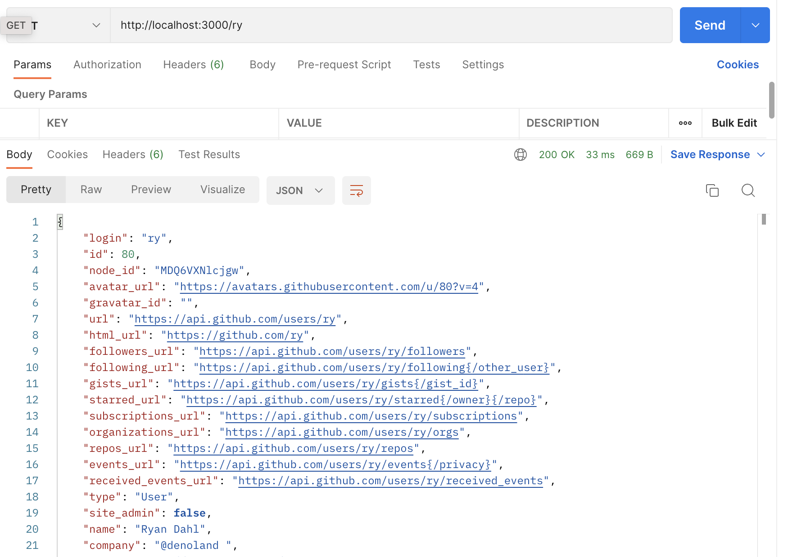

<<<<<<< HEAD
# 如何在 Deno 中使用 Redis

[Redis](https://redis.io/)
是一种可以用于缓存、作为消息代理或数据流的内存数据存储。

[在此查看源代码。](https://github.com/denoland/examples/tree/main/with-redis)

在这里，我们将设置 Redis 以缓存来自 API
调用的数据，以加快对该数据的任何后续请求。我们将要做的是：

- 设置 Redis 客户端，将每个 API 调用的数据保存在内存中。
- 设置一个 Deno 服务器，以便我们可以轻松地请求某些数据。
- 在服务器处理程序中调用 Github API，以便在第一次请求时获取数据。
- 在每次后续请求时从 Redis 中提供数据。

我们可以在单个文件 main.ts 中完成这些操作。

## 连接到 Redis 客户端

我们需要两个模块。第一个是 Deno 服务器。我们将使用它来获取用户信息以查询我们的
API。第二个是 Redis。我们可以使用 `npm:` 修饰符来获取 Redis 的 node 包:
=======
# How to Use Redis with Deno

[Redis](https://redis.io/) is an in-memory data store you can use for caching,
as a message broker, or for streaming data.

[View source here.](https://github.com/denoland/examples/tree/main/with-redis)

Here we’re going to set up Redis to cache data from an API call to speed up any
subsequent requests for that data. We’re going to:

- Set up a Redis client to save data from every API call in memory
- Set up a Deno server so we can easily request certain data
- Call the Github API within the server handler to get the data on first request
- Serve data from Redis on every subsequent request

We can do this within a single file, `main.ts`.

## Connecting to a Redis client

We need two modules. The first is the Deno server. We’ll use this to get the
information from the user to query our API. The second is Redis. We can grab the
node package for Redis using the `npm:` modifier:
>>>>>>> f66f5ac99824533702df0e6b89a7e4d862da402f

```tsx, ignore
import { Server } from "https://deno.land/std@$STD_VERSION/http/server.ts";
import { createClient } from "npm:redis@^4.5";
```

<<<<<<< HEAD
我们使用 `createClient` 创建一个 Redis 客户端，并连接到我们的本地 Redis 服务器：
=======
We create a Redis client using `createClient` and connect to our local Redis
server:
>>>>>>> f66f5ac99824533702df0e6b89a7e4d862da402f

```tsx, ignore
// make a connection to the local instance of redis
const client = createClient({
  url: "redis://localhost:6379",
});

await client.connect();
```

<<<<<<< HEAD
此[配置对象](https://github.com/redis/node-redis/blob/master/docs/client-configuration.md)还可以分别设置主机、用户、密码和端口。

## 设置服务器

我们的服务器将充当 Github API 的包装器。客户端可以在 URL
路径名中调用我们的服务器，例如 `http://localhost:3000/{username}`。

将路径名解析并调用 Github API
将发生在我们服务器的处理程序中。我们去掉了前导斜杆，因此我们剩下一个可以作为用户名传递给
Github API 的变量。然后，我们将响应传递回用户。
=======
You can also set host, user, password, and port individually in this
[configuration](https://github.com/redis/node-redis/blob/master/docs/client-configuration.md)
object.

## Setting up the server

Our server is going to act as a wrapper around the Github API. A client can call
our server with a Github username in the URL pathname, such as
`http://localhost:3000/{username}`.

Parsing out the pathname and calling the Github API will take place inside a
handler function in our server. We strip the leading slash so we are left with a
variable we can pass to the Github API as a username. We’ll then pass the
response back to the user.
>>>>>>> f66f5ac99824533702df0e6b89a7e4d862da402f

```tsx, ignore
const server = new Server({
  handler: async (req) => {
    const { pathname } = new URL(req.url);
    // strip the leading slash
    const username = pathname.substring(1);
    const resp = await fetch(`https://api.github.com/users/${username}`);
    const user = await resp.json();
    return new Response(JSON.stringify(user), {
        headers: {
          "content-type": "application/json",
        },
      });
    }
  },

  port: 3000,
});

server.listenAndServe();
```

<<<<<<< HEAD
我们将使用以下命令运行此操作：
=======
We’ll run this with:
>>>>>>> f66f5ac99824533702df0e6b89a7e4d862da402f

```tsx, ignore
deno run --allow-net main.ts
```

<<<<<<< HEAD
如果我们在 Postman 中转到
[http://localhost:3000/ry](http://localhost:3000/ry)，我们将收到 Github 响应：


让我们使用 Redis 缓存该响应。

## 检查缓存

一旦我们从 Github API 中获取到响应，我们就可以使用`client.set`将其在 Redis
中进行缓存，其中我们的用户名为键，用户对象为值：
=======
If we then go to [http://localhost:3000/ry](http://localhost:3000/ry) in
Postman, we’ll get the Github response:


Let’s cache this response using Redis.

## Checking the cache

Once we have our response from the Github API, we can cache this within Redis
using `client.set`, with our username as the key and the user object as the
value:
>>>>>>> f66f5ac99824533702df0e6b89a7e4d862da402f

```tsx, ignore
await client.set(username, JSON.stringify(user));
```

<<<<<<< HEAD
下次请求相同的用户名时，我们可以使用 `client.get` 获取缓存的用户：
=======
Next time we request the same username, we can use `client.get` to get the
cached user:
>>>>>>> f66f5ac99824533702df0e6b89a7e4d862da402f

```tsx, ignore
const cached_user = await client.get(username);
```

<<<<<<< HEAD
如果键不存在，则返回
null。因此，我们可以在一些流程控制中使用它。当我们获取用户名时，我们将首先检查是否已在缓存中拥有该用户。如果是，我们会提供缓存的结果。如果不是，则调用
Github API 获取用户、缓存它，然后提供 API
结果。在这两种情况下，我们都将添加一个自定义标题以显示我们正在服务的版本：
=======
This returns null if the key doesn’t exist. So we can use it in some flow
control. When we get the username, we’ll initially check whether we already have
that user in the cache. If we do we’ll serve the cached result. If not, we’ll
call the Github API to get the user, cache it, the serve the API result. In both
cases, we’ll add a custom header to show which version we’re serving:
>>>>>>> f66f5ac99824533702df0e6b89a7e4d862da402f

```tsx, ignore
const server = new Server({
  handler: async (req) => {
    const { pathname } = new URL(req.url);
    // strip the leading slash
    const username = pathname.substring(1);
    const cached_user = await client.get(username);
    if (cached_user) {
      return new Response(cached_user, {
        headers: {
          "content-type": "application/json",
          "is-cached": "true",
        },
      });
    } else {
      const resp = await fetch(`https://api.github.com/users/${username}`);
      const user = await resp.json();
      await client.set(username, JSON.stringify(user));
      return new Response(JSON.stringify(user), {
        headers: {
          "content-type": "application/json",
          "is-cached": "false",
        },
      });
    }
  },

  port: 3000,
});

server.listenAndServe();
```

<<<<<<< HEAD
第一次运行时，我们将得到与上面相同的响应，并且我们将看到 `is-cached` 标题设置为
`false`：


但是再次使用相同的用户名进行呼叫，我们将获得缓存的结果。主体是相同的：



但是标题显示我们拥有缓存：


我们还可以看到响应速度快了约 200ms！

您可以在此处查看 Redis 文档[https://redis.io/docs/](https://redis.io/docs/)和
Redis node
包[https://github.com/redis/node-redis](https://github.com/redis/node-redis)。
=======
Running this first time gives us the same response as above, and we’ll see the
`is-cached` header set to `false`:


But call with the same username again, and we get the cached result. The body is
identical:


But the header shows we have the cache:


We can also see that the response was ~200ms quicker!

You can check out the Redis documentation [here](https://redis.io/docs/) and the
Redis node package [here](https://github.com/redis/node-redis).
>>>>>>> f66f5ac99824533702df0e6b89a7e4d862da402f
